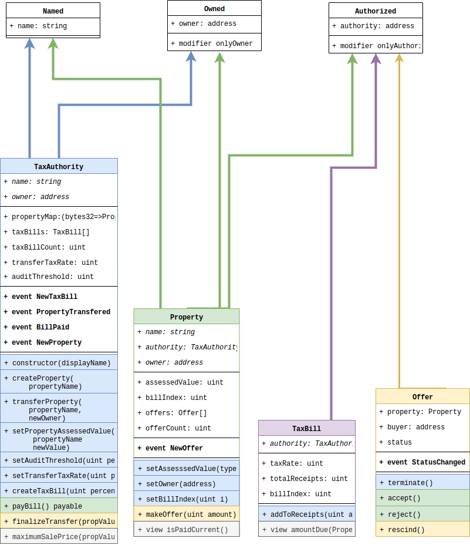

# Taxblock

_Protoype for property tax and property transfer management via blockchain._

# Files in this repo

* __README.md__
* __taxblock_solidity/__ - solidity contracts (.sol files) that compose the DApp API
* __taxblock/__ - python wrappers for compiling and testing solidity contracts
* __test_contracts.py__ - python script to compile all .sol files in taxblock_solidity
* __demo.ipynb__ - a walkthrough demonstrating core functionality of taxblock contracts and python wrappers

# Taxblock rules

The core of taxblock is a set of contracts that allow the taxation and transfer of property with restrictions meant to reduce fraud. It guarantees the following rules:

1. The tax authority sets all rates and assessed property values
2. When a property is sold, taxes are automatically deducted to pay the tax authority
3. A property cannot be sold for a price that varies too greatly from the assessed value
4. A property cannot be sold if it has unpaid tax bills

There are two main users in the system, a tax authority and property owners, who may be considered sellers or buyers at times.

The tax authority is analogous to a city or town. The tax authority:

1. sets the __transfer tax rate__; 
2. issues __tax bills__; 
3. sets the __assessed value__ of each property; and 
4. sets the __audit threshold__ that limits how much sale prices can vary from a property's assessed value. 

The __transfer tax rate__ and _all rates in taxblock are represented as a per-1000 or permille amount_. When a property is sold, this amount is due to the tax authority:

        TRANSFER_TAX_DUE = TRANSFER_RATE * SALE_PRICE / 1000

This amount is automatically deducted from sale transactions as we will see in the "Accepting an offer" section.

The __tax bills__ are issued whenever a tax authority wishes to do so. Whenever a tax bill is issued, every property within the tax authority owes this amount to the tax authority:

        TAX_BILL_DUE = TAX_BILL_RATE * PROPERTY_ASSESSED_VALUE / 1000
        
While transfer taxes are deducted automatically, property owners must pay tax bills manually. Because the creation of tax bills emits an event, an owner could use this API to create an auto-pay functionality). A property cannot be sold by its owner if there are unpaid tax bills.

# Taxblock workflow

This section describes how the taxblock system is used in the real world with some detail about relevant portions of the API.

### 1. Creating a tax authority

Anyone can create a tax authority contract simply by constructing an instance of the TaxAuthority contract. Each contract has a unique address which cannot be forged. 

__LAST MILE NOTE:__ A property owner must ensure that they use the correct contract address for their city or town, or else they may be buying and selling properties and paying taxes on properties which do not exist in the real world. One way to exchange these addresses is through QR codes, which can be posted in town hall. A user should scan this QR code before doing any transactions.

The tax authority should at this point configure the __transfer tax rate__ and __audit threshold__ as described above.

### 2. Creating properties

A tax authority creates a property and the owner of the property, which has a unique name not longer than 32 characters. It is up to the tax authority to decide on a naming convention, but it could be street address or a hashed street address. 

The initial assessed value is set to zero, and the owner is set to the creator of the property, so it must be transfered and assessed. No tax bills prior to this point are due on the property, so the town hall employees must have a policy not to add properties that have delinquent taxes or they will not be represented in the system.

__LAST MILE NOTE:__ Since each property must be manually added to taxblock, and thousands or hundreds of thousands of properties might exist in the real world, predating the tax block system, it is recommended that towns phase in the addition of properties on to the tax block system. They might want to offer tax incentives to people who switch first, and then eventually require all new transactions to be done through the taxblock system.

__API:__ The owner of a TaxAuthority contract instance can create properties by calling the contract's _createProperty(bytes32 propertyName)_ method.

### 3. Issuing tax bills

Now that the tax authority has created some properties, it is time for revenue. The tax authority issues a tax bill, such as a quarterly property ownership tax, or a one-time tax to build a new school.

When the tax bill is created, no property can be transferred unless it pays that bill.

__API:__ The owner of a TaxAuthority contract instance can issue tax bills by calling the contract's _createTaxBill(uint rate)_ method.

### 4. Paying taxes

__API:__ Anyone but usually the property owner can pay a tax bill by calling the TaxAuthority's _payBill(Property property)_ method, which is payable. This pays the next unpaid tax bill in order that they were created if any exist.

### 5. Making an offer

When someone wants to buy a property, they can make an offer on the property. If the taxes have been paid, and the purchase price does not exceed the maximum sale price, the offer is valid. The maximum sale price is determined by:

        MAXIMUM_SALE_PRICE = PROP_VAL + PROP_VAL * AUDIT_THRESH / 1000
        
__API:__ The offer can be made by creating an _Offer_ contract instance and passing it to a property's _makeOffer(Offer offer)_ method.

The Offer contract's constructor is payable and it must be funded at the time it is created. The amount paid to the constructor call is the SALE_PRICE.

__LAST MILE NOTE:__ The fact that a proeprt cannot exceed MAXIMUM_SALE_PRICE is the most critical component in this system. If an individual wishes to sell a property for far more than its current assessed value, the owner must contact town officials and ask them to reassess the property higher. Officials may wish to use this interaction to trigger an audit and assess some additional penalties. This would have to be done on a case-by-case basis, and that is why it is meant to break a property's transferability.

### 6. Accepting an offer

__API:__ If a valid offer is made, the owner can accept it with the offer contract's _accept()_ method.

The balance of the offer is transfered to the tax authority, which then:

1. transfers the SALE_PRICE less TRANSFER_TAX_DUE to the seller;
2. changes the property's owner to the buyer address

# Additional use cases and real-world analogies

### 1. Repossession

A tax authority and only a tax authority can arbitrarily change the owner of any property at any time. To repossess a property, set the property's owner to the tax authority's address.

__API:__ Do this using the property contract's _setOwner()_ method.

__Implementation__: Internally, each property has a _billIndex_ value, which corresponds to an index in the tax authority's _taxBills_ array. The property's _billIndex_ is represents the next unpaid bill, and if it is greater than the last index in the array, the property is considered paid current. Bills can only be paid in order as a result of this internal structure.

###  2. Tax auction

A tax authority might wish to auction a property for the highest bid. To do so, repossess the property and then set the assessed value to an incredibly high number, preventing the MAXIMUM_SALE_PRICE limitation.

__API:__ This requires use of the property's _setAssessedValue()_ method.

# Useful features not implemented

There are many extensions that could make Taxblock more useful, which I did not have time to implement. I will describe some of them below, and how they could be implemented.

### 1. Taxing gifts

This system DOES NOT prevent properties from being sold below a minimum sale price, which could be considered a gift. This can be implemented by adding a MINIMUM_SALE_PRICE restriction on creating Offers.

### 3. Forgiving taxes

Because a TaxAuthority can set a property's _billIndex_ arbitrarily (see the section on "Repossession" above), a TaxAuthoirty could forgive past taxes. This would require the addition of a method on the TaxAuthority contract, called _setPropertyTaxIndex(Property property, uint newIndex)_ that would then call the property's _setBillIndex()_ method.

# Contract interface diagram

This diagram contains the API functions in the contracts but excludes some functions used primarily for internal purposes.

The color coding corresponds with calls that are meant to be made from other contracts. For instance, the TaxAuthority contract is blue, so every method in other contracts that are meant for the TaxAuthority to call are blue.

Some shared properties have been abstracted into the Owned, Named and Authorized contracts.

